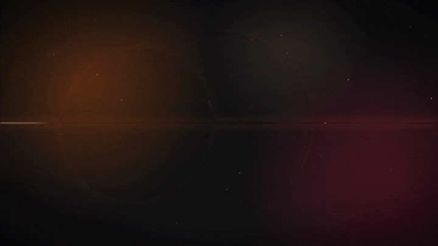

# Vault Patcher

A desktop patcher, tweaker and mod installer for the Borderlands series, in the spirit of
MarkerPatch (Dead Space 2) and Fallout 76 Quick Configuration. Built in Rust with
[GPUI](https://github.com/zed-industries/zed/tree/main/crates/gpui) and
[gpui-component](https://github.com/longbridge/gpui-component).

<p align="center">
  
</p>

**Borderlands 2** and **Borderlands GOTY Enhanced** are fully supported. **The Pre-Sequel** is
in preview (detection, tweaks, presets, SDK install).

## Modes

Toggle between modes at the top of the navigation pane.

- **Simple** (default): a MarkerPatch-style **One-Click Setup** plus a short **Quick Settings**
  page that saves as you change things. The setup bundle for BL2 includes:
  - Modern Defaults: borderless window at native resolution, framerate matched to your
    monitor, lower input lag, no motion blur or texture pop-in, skipped logos and ads,
    console on `~`.
  - Skip the launcher, and the 4 GB memory patch.
  - DXVK (Vulkan) with a tuned `dxvk.conf`, plus an HD Visual Upgrade.
  - The Python SDK, bug-fix mods (Firing Fix, Automatic Reload Fix), and BL3/BL4-style
    quality of life (vendor refills, auto pickup, loot lights, no ads, quick startup, plus
    opt-in instant vehicles and menu controls). Mods are enabled automatically.

  - **Vault Patcher Community Patch**: a balance-neutral text-mod patch built on the user's
    own PC from pinned upstream files. It takes the Unofficial Community Patch's bug-fix
    section (balance, loot and difficulty changes excluded), apple1417's Text Fixes, and
    Apocalyptech's Sorted Fast Travel, plus Gearbox's official hotfixes. Everything is
    merged into one offline file (`Binaries/VaultPatcher.blcm`) that Text Mod Loader
    auto-runs. Mega TimeSaver XL can be added as an opt-in. Nothing third-party is
    redistributed; see `src/textmod.rs`.

  *Restore vanilla* undoes everything, and every change is backed up first.
  *Re-apply all* puts your Vault Patcher settings and upgrades back when the
  game or its launcher rewrites them (a backup is taken first, too).
- **Advanced**: every tweak, preset, exe patch and mod-manager tool, as described below.

## Comparison images

Settings that Nvidia's tweak guide covers link to its interactive comparison pages. Those
pages are linked, never bundled, because Nvidia's terms don't allow redistribution. Our own
images are captured by the maintainers. Borderlands 2's set ships inside the app as embedded
assets, so nothing is downloaded for it; other games fetch their set once it's published.
Your own re-shot images are never replaced. Anyone can re-shoot them from
**App Settings → Tools → Comparison Capture**, which runs these steps on their own PC:

1. Writes each option of a setting.
2. Launches the game straight into a chosen save (via Quick Startup's `-Character=`).
3. A tiny helper SDK mod closes startup notices, hides the HUD and weapon, and signals ready.
   The app grabs the game window, then the helper quits.
4. The screenshot is stored as a JPEG in the data folder's `comparisons` folder.
5. Settings are restored afterwards.

Settings pages are a searchable list with a detail pane. For settings with images, the
pane shows your current option and any other side by side with a draggable divider; click
a thumbnail to compare against it, or open the full-window viewer (← → switch sides, Esc
closes).

## Features

- **82 config tweaks for BL2** across display, framerate, world detail, AA, textures,
  outlines/cel shading, post-processing, shadows, PhysX, FOV, console, HUD, gameplay, audio,
  startup and network. Each one shows its ini location, default, performance cost, and
  whether the in-game menu also manages it.
- **Search** across every setting (Ctrl+F), with filters for changed and waiting values.
- **Staged edits**: nothing is written until you press *Apply* (Ctrl+S). *Review* lists
  every change as old → new first, and every save offers *Undo*. Applying edits only the
  lines involved, keeps comments, duplicate keys and formatting intact, and keeps the
  launcher's private `LauncherConfig\WillowEngine.ini` in sync.
- **Profiles**: save your current settings under a name, load them later, and export or
  import them as files to share.
- **Health check** on the Overview page (game and settings found, read-only files, 4 GB
  patch, SDK up to date, DXVK support), each with a link to the fix.
- **Presets** (Community Essentials, Clean Look, Pandora Ultra, Balanced, Competitive FPS,
  Potato Mode, Factory Settings).
- **Exe patches**: Large Address Aware plus the four classic BL2/TPS console hex edits.
  Each patch is matched by byte signature, so it's only offered when it matches exactly once.
- **Mod manager**: one-click install and update of the latest Willow2 Python SDK from
  GitHub, SDK mod and text mod install/enable/disable/remove (drop files onto the window,
  or right-click a mod), and core SDK modules locked.
- **Backups**: every apply, patch and SDK install is snapshotted first and can be restored
  in one click.
- **Portable**: settings, backups, profiles and images live in a `VaultPatcher Data`
  folder next to `VaultPatcher.exe`, so the app and its data move together. Where that
  folder can't be written (an exe in Program Files) it uses `%APPDATA%\VaultPatcher`
  instead, and data an older version kept there moves next to the exe on first run.
  `VAULT_PATCHER_DATA_DIR` overrides the location.
- **App frame rate**: Vault Patcher redraws only while something changes, and animations
  run at *Balanced* by default: the even fraction of your display's refresh rate nearest
  45 fps (45 at 180 Hz, 48 at 144 Hz, 40 at 120 Hz). 30 fps, 60 fps and the full display
  rate are in App settings. It's the app's own frame rate, never the game's.
- **Launch options** on the Overview page (`-NoLauncher`, `-NoStartupMovies` and more),
  used by the sidebar's Play button; its dropdown can also start BL2/TPS through the
  game's own launcher, or the game exe directly no matter what the options say, and
  whichever you pick there becomes the Play button's default.
- **Game running**: while a supported game runs (BL2, TPS or BL1 GOTY Enhanced), a screen
  shows the running state with *Force close* and *Minimize to background*.
- **Minimize to background**: parks the app while the game plays (window minimized, UI
  sounds and music muted, near-zero redraw and timer work so it sips CPU and memory) and
  wakes back up when the game exits.
- **Look and feel**: a native Windows 11 app. It follows your Windows light or dark mode
  and accent color (live, as you change them), sits on Mica with acrylic menus, tooltips
  and notifications, and uses the WinUI control
  metrics, the Segoe UI Variable type ramp, Segoe Fluent Icons and Fluent motion (page
  transitions, the navigation pill, dialogs, toasts). It honors Windows' "Animation
  effects" setting. The navigation pane collapses to icons below 1008px wide or from the
  menu button, and Back (Alt+Left or the mouse back button) retraces your pages. The
  game's own art is read from your PC: the Steam library banner and logo head the Setup
  and Overview pages, and each game's exe icon appears in the game switcher. Optional
  button sounds come from the game's launcher audio files (nothing is bundled).
- **Window controls**: the title bar's caption buttons are real Windows hit-test regions,
  so Snap Layouts, double-click to maximize and dragging behave like any Windows app.
- **Bundled comparison images**: our own Borderlands 2 screenshots are embedded in the exe,
  so there's no first-run download for them (see *Comparison images* above).
- **Updates and support**: checks for a newer Vault Patcher and mod SDK at startup, and
  *Copy diagnostics* puts a bug-report summary on the clipboard.
- **Detection** of Steam libraries, Epic Games installs, and `Documents\My Games` config
  folders, with manual overrides.

## Build

```sh
cargo run            # debug
cargo build --release
cargo test           # unit tests
cargo test -- --ignored --nocapture   # read-only checks against a local BL2 install
```

`cargo build --release` produces one self-contained `VaultPatcher.exe`: fonts, icons, the
logo and the comparison images are embedded, the C runtime is linked statically
(`.cargo/config.toml`), and the app icon is scaled at build time from
`assets/brand/logo.png`, which Blender renders from `assets/brand/source/logo.py`
(`blender -b --python assets/brand/source/logo.py -- logo.png 1024`). Everything else
(mods, DXVK) is downloaded to the user's PC on demand.

Requires Windows 10/11; Mica needs Windows 11 22H2 or later (earlier versions get a solid
background). Text uses the system Segoe UI Variable (Segoe UI on Windows 10) and icons are
drawn from the installed Segoe Fluent Icons (Segoe MDL2 Assets on Windows 10); neither is
bundled. Noto Sans is bundled under the OFL as a fallback for PCs missing Segoe UI.
Set `VAULT_PATCHER_THEME=light` or `dark` to preview a theme without changing Windows.

## Architecture

```
src/
  core/        game-agnostic: ini engine, Steam/Epic detection, backups, PE/hex patching,
               game art (Steam library cache, exe icons)
  tweaks/      tweak model (Control + Binding), ConfigSet, table builders
  games/       one module per game; willow.rs holds the shared BL2/TPS catalog
  pages/       one module per page kind; each renders from the shared Workspace
  mods.rs      SDK + mod install logic
  patches.rs   exe patch definitions
  workspace.rs shared app state and every mutation
  health.rs    Overview health checks and the diagnostics report
  applied.rs   what Vault Patcher last wrote, so "Re-apply" can put it back
  profiles.rs  named settings profiles (JSON)
  compare.rs   bundled per-setting comparison images and the capture tool
  app.rs       window shell: title bar, navigation pane, page host, Apply bar, toasts, dialogs
  theme.rs     WinUI theme brushes (mirrored into gpui-component), rarity colors, icons
  win11.rs     Windows theme and accent, Mica, animation setting, system icon glyphs
  ui.rs        widgets: buttons, switches, sliders, chips, setting rows
vendor/        our fork of gpui and gpui-component (acrylic blur, scale transforms);
               see vendor/README.md
```

### Adding a tweak
Add one entry to the game's `TWEAKS` table (e.g. `games/willow.rs`) with `toggle`,
`slider`, `choice` or `custom`. Keys listed after the first are mirror copies, written
only if that file exists. Tests check ids, categories and preset references.

### Adding a page
Add a `PageKind` variant, a module in `pages/`, and a match arm in `pages::render`, then
list it in a game's `nav`.

### Adding a game
Create `games/<id>.rs` with a `GameDef` (detection, config folder, ini files, tweaks,
presets, patches, mod support, nav), then register it in `games::all()`.

## Sources

Tweak keys and option values were checked against a live install and the game's
localization files. Background research came from PCGamingWiki, the Nvidia BL2/TPS tweak
guide, OpenBLCMM (`IniTweaksPanel`, `HexDictionary`), the BLCMods Hex-Edits wiki, and the
bl-sdk projects. Not affiliated with Gearbox Software or 2K.

## License

Vault Patcher is free software under the [GNU General Public License v3.0 or later](LICENSE).
Bundled assets keep their own licenses: Noto Sans (SIL OFL, `assets/fonts/NotoSans-OFL.txt`).
Borderlands is a trademark of Gearbox Software; this project isn't affiliated with Gearbox
or 2K.
